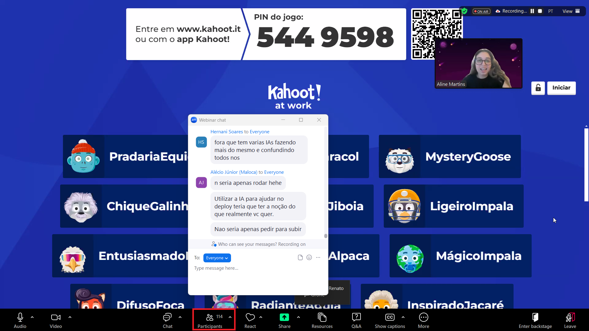
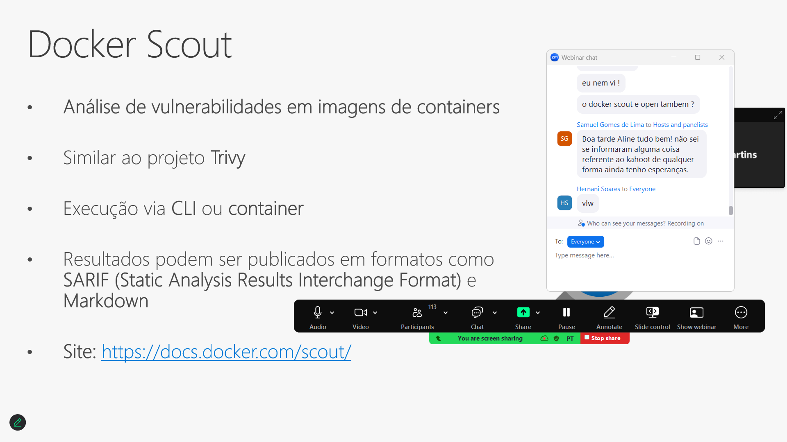

# SegurancaContainers_DevOpsExperience-2025-03
Conteúdos sobre Segurança em Containers de apresentação realizada durante a edição de Março-2025 do DevOps Experience.

---

Título da apresentação: **Segurança em Containers: boas práticas, ferramentas, pontos de atenção...**

Data: **27/03/2025 (quinta-feira)**

Tipo do evento: **Online**

Ferramenta de transmissão: **Zoom**

Tecnologias e tópicos abordados: **Docker, Kubernetes, Terraform, Azure DevOps, GitHub Actions, Azure Kubernetes Service, kind, Linux, Docker Scout, KICS, Checkov...**

Número de participantes: **114 pessoas (pico de audiência ao longo da live)**

Link do evento: [**LinkedIn**](https://www.linkedin.com/posts/devopsheroes_devopsexperience-devopsheroes-cloud-activity-7299839683763576834-K5tF/)

---

