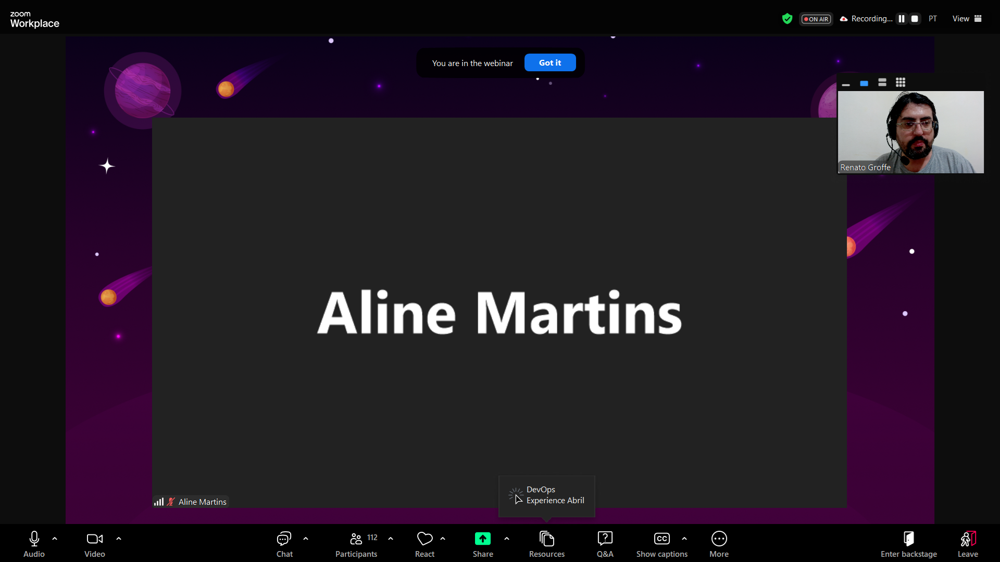
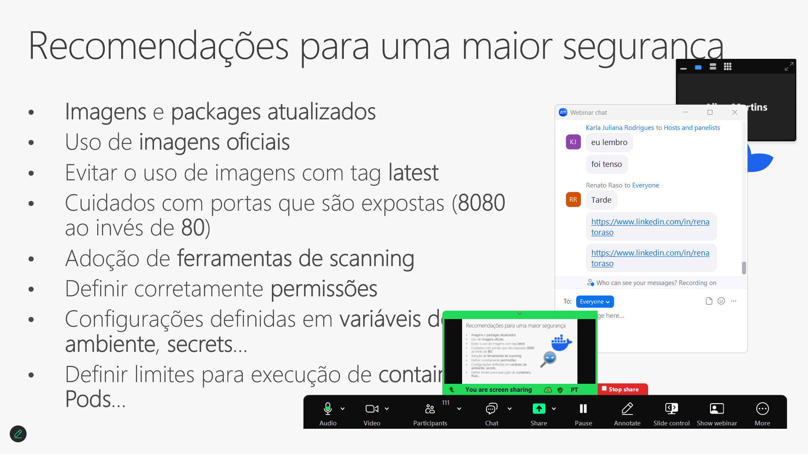
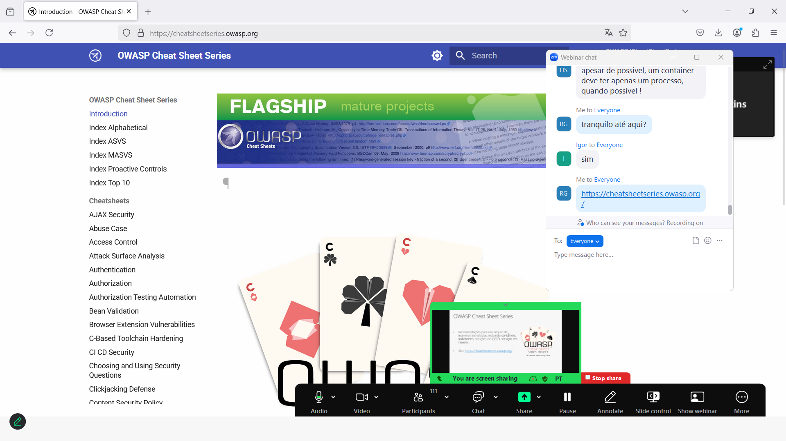
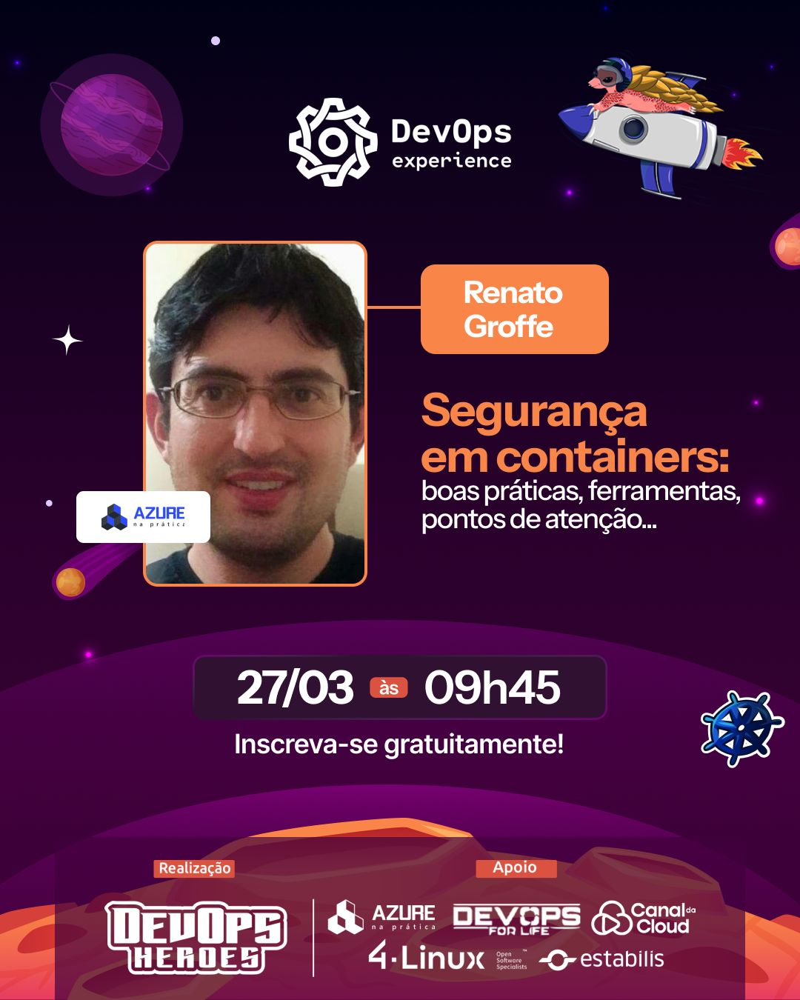
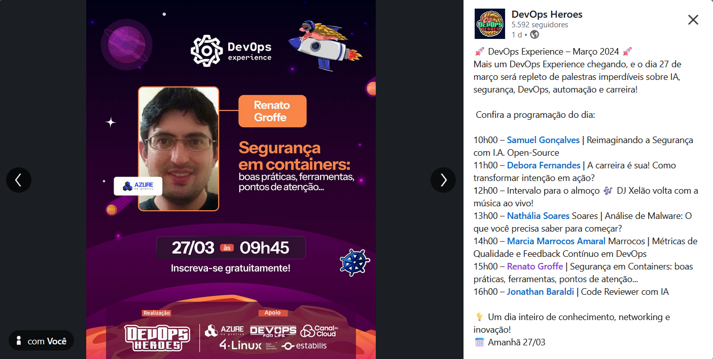

# SegurancaContainers_DevOpsExperience-2025-03
Conteúdos sobre Segurança em Containers de apresentação realizada durante a edição de Março-2025 do DevOps Experience.

Exemplos - clique nos links a seguir para acessar os repositórios correspondentes às demos:
- [**Pipeline do Azure DevOps com execução do Docker Scout via container**](https://github.com/renatogroffe/AzureDevOps-DockerScout_Container-DotNet6)
- [**Pipeline do Azure DevOps com execução do Docker Scout via CLI**](https://github.com/renatogroffe/AzureDevOps-DockerScout-DotNet6)
- [**Workflow do GitHub Actions com execução do Docker Scout via CLI**](https://github.com/renatogroffe/GitHubActions-DockerScout-DotNet6)
- [**Pipeline do Azure DevOps com execução do Checkov para análise de arquivos Dockerfile**](https://github.com/renatogroffe/AzureDevOps-Checkov-Dockerfile)
- [**Pipeline do Azure DevOps com execução do Checkov para análise de arquivos YAML do Kubernetes**](https://github.com/renatogroffe/AzureDevOps-Checkov-YAML_Kubernetes)
- [**Pipeline do Azure DevOps com execução do KICS para analisar a segurança de um script Terraform que cria um cluster Kubernetes no Azure**](https://github.com/renatogroffe/AzureDevOps-KICS-Terraform-AKS)
- [**Pipeline do Azure DevOps com execução do Trivy para analisar vulnerabilidades de um cluster Kubernetes (criado com o emulador kind)**](https://github.com/renatogroffe/AzureDevOps-Trivy-kind)

---

Título da apresentação: **Segurança em Containers: boas práticas, ferramentas, pontos de atenção...**

Data: **27/03/2025 (quinta-feira)**

Tipo do evento: **Online**

Ferramenta de transmissão: **Zoom**

Tecnologias e tópicos abordados: **Docker, Kubernetes, Terraform, Azure DevOps, GitHub Actions, Azure Kubernetes Service, kind, Linux, Docker Scout, KICS, Checkov...**

Número de participantes: **114 pessoas (pico de audiência ao longo da live)**

Link do evento: [**LinkedIn**](https://www.linkedin.com/feed/update/urn:li:activity:7310757120990179329/)

Deixo aqui meus agradecimentos ao **Daniel Ginês** e à **Aline Martins** por todo o apoio para que eu partipasse como palestrante de mais uma edição do **DevOps Experience**.

---

Outros prints podem ser encontrados neste [**diretório**](/img/).